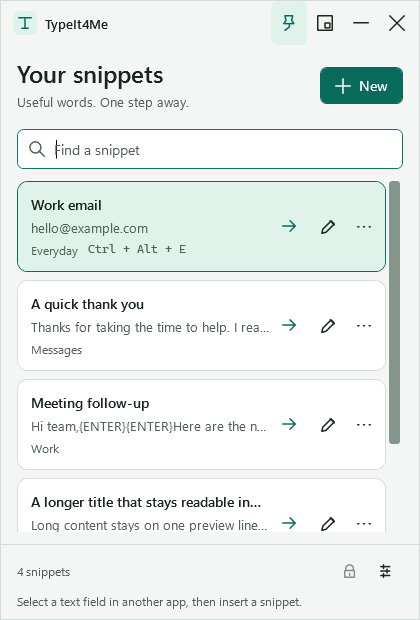
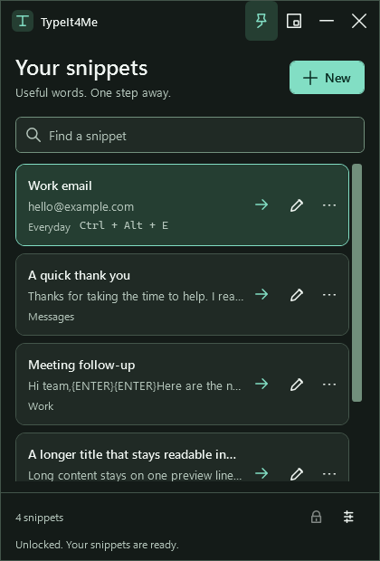
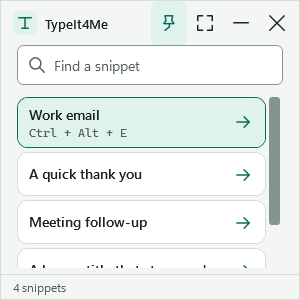
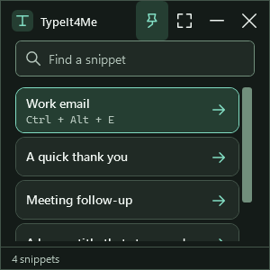

# TypeIt4Me

[](https://github.com/Avicennasis/TypeIt4Me/actions/workflows/test.yml)
[](https://scorecard.dev/viewer/?uri=github.com/Avicennasis/TypeIt4Me)
[](https://github.com/Avicennasis/TypeIt4Me/releases)
[](LICENSE)

Instant access to the text you use every day. TypeIt4Me is a lightweight Windows utility with a floating snippet library, global hotkeys, and local storage, built with .NET 8 WPF.

Click a snippet to type it into the last application you used, or assign it a global key combination. Text insertion uses Windows `SendInput` without copying snippet content to the clipboard. Typing an abbreviation does **not** automatically expand it.

## A compact home for useful words

 

- Search names, categories, content, and hotkeys. Insert the selected result with Enter.
- Keep the floating window above other apps with the pin button.
- Switch to Mini Mode for just search and quick insertion; full and Mini Mode sizes are remembered separately.
- Edit names, categories, global hotkeys, and multiline content in a dedicated editor with validation and a command reference.
- Choose light or dark colors in Settings. Windows high-contrast colors take priority.
- Keep running in the system tray, configure auto-lock, and manage PIN protection and backups in Settings.

 

The screenshots show the current source on Windows 11 with synthetic snippets. See the [complete screenshot gallery](docs/screenshots/README.md), [design system](docs/UI-DESIGN.md), and [verification record](docs/VALIDATION.md). Older release downloads may have the previous interface.

## Install and use

Download `TypeIt4Me.exe` from [Releases](https://github.com/Avicennasis/TypeIt4Me/releases). The self-contained Windows x64 build can run without installing the .NET SDK. Build from source for the current development version.

1. Choose **New** and enter a name and the text you want to reuse. Category and global hotkey are optional.
2. Select a text field in another application, return to TypeIt4Me, and click the snippet. Its arrow indicates insertion; edit and more actions sit beside it.
3. Alternatively, press the snippet's global hotkey, such as **Ctrl + Alt + E**. Reserved or conflicting combinations are reported after registration.
4. Open **Settings** with the footer button or **Ctrl + ,** for appearance, tray behavior, locking, import, and export.
5. With tray mode enabled, closing or minimizing hides the window. Double-click its tray icon to restore; choose **Exit** from the tray menu to quit.

Input must target a normal application that accepts keyboard input. Elevated applications, reserved shortcuts, and applications that reject injected input may not work. TypeIt4Me reports when it cannot return focus to the target.

## Keyboard access

| Action | Shortcut |
| --- | --- |
| Search / clear search | Ctrl + F / Escape |
| Move from search to results | Down |
| Insert selected snippet | Enter |
| Edit selected snippet | F2 |
| Confirm deletion | Delete |
| Open snippet actions | Shift + F10 |
| New snippet | Ctrl + N |
| Enter / leave Mini Mode | Ctrl + M |
| Settings / Help | Ctrl + , / F1 |
| Lock, when a PIN is set | Ctrl + L |
| Save in the editor | Ctrl + S |
| Cancel a dialog | Escape |
| Move between controls | Tab / Shift + Tab |
| Windows system menu | Alt + Space |

In the content editor, Enter inserts a newline and Tab leaves the field. Closing an editor with changes shows an inline discard confirmation. Search Enter waits for the current search to finish.

## PIN protection and local data

Without a PIN, snippets and exports are plain JSON. Setting a PIN encrypts the saved collection and exports. Changing or removing a PIN requires the current PIN; removal explicitly saves snippets as plain text. There is no PIN recovery: keep your PIN and backups safe.

- **Format:** existing V3 AES-256-CBC with HMAC-SHA256 authentication. Each save uses a fresh random 32-byte salt; encryption key, IV, and authentication key are derived from the PIN and salt using PBKDF2-SHA256 with 600,000 iterations.
- **PIN verifier:** `settings.json` stores a salted PBKDF2-SHA256 hash, not the plaintext PIN. PIN creation requires at least four characters; six or more is recommended.
- **Locking:** hides the collection, disables snippet actions, and unregisters snippet hotkeys. Auto-lock measures inactivity in TypeIt4Me, with 0 disabling it and 1–1440 minutes supported. Settings can require unlocking when restoring from the tray.
- **Memory limits:** the active PIN is held in a mutable character buffer and cleared when locking or disposing. Cryptographic buffers are cleared after use. Snippet strings remain in process memory; locking does not guarantee that all text is erased from RAM. An active data operation finishes before its PIN buffer is cleared.
- **Insertion:** uses `SendInput`. TypeIt4Me does not write snippet content to clipboard history. Commands that press keys can still cause the target application to perform its own actions.
- **Content limit:** 102,400 characters per snippet, matching the input-injection limit.

| File | Location |
| --- | --- |
| Snippets | `%AppData%\TypeIt4Me\snippets.json` |
| Settings and PIN verifier | `%AppData%\TypeIt4Me\settings.json` |
| Error log | `%AppData%\TypeIt4Me\error.log` |

Import **adds** snippets to the collection; it does not replace it. Export uses the current collection's PIN protection. Existing settings and snippet files do not need migration for this UI update. Back up both data files before changing PIN protection.

## Special keys and commands

Combine ordinary text with case-insensitive commands in braces. Unknown commands are typed literally. The editor's **Special commands & examples** section and Help contain an in-app reference.

| Commands | Meaning |
| --- | --- |
| `{TAB}`, `{ENTER}` / `{RETURN}`, `{ESC}` / `{ESCAPE}` | Tab, Enter, Escape |
| `{BACKSPACE}`, `{DELETE}` / `{DEL}`, `{INSERT}` / `{INS}` | Editing keys |
| `{HOME}`, `{END}`, `{PAGEUP}` / `{PGUP}`, `{PAGEDOWN}` / `{PGDN}` | Navigation |
| `{UP}`, `{DOWN}`, `{LEFT}`, `{RIGHT}` | Arrow keys; `ARROWUP`, `ARROWDOWN`, `ARROWLEFT`, `ARROWRIGHT` also work |
| `{SPACE}`, `{F1}` through `{F12}` | Space and function keys |
| `{CAPSLOCK}` / `{CAPS}`, `{NUMLOCK}`, `{SCROLLLOCK}`, `{PRINTSCREEN}` / `{PRTSC}` | Toggle and special keys |
| `{SHIFT}`, `{CTRL}` / `{CONTROL}`, `{ALT}`, `{WINKEY}` / `{WIN}` / `{LWIN}` / `{RWIN}` | A modifier press and release |
| `{SLEEP 500}` | Pause for 500 milliseconds; valid range is 1–60,000 |

**Modifier commands do not hold a modifier for the next character.** For example, `{CTRL}a` presses and releases Ctrl, then types `a`; it does not select all.

```text
Hello{TAB}World{ENTER}
Starting...{SLEEP 1000}Done!
```

The first example types Hello, presses Tab, types World, and presses Enter. The second pauses for one second between the two phrases.

## Build and verify

Use Windows with the .NET 8 SDK and Windows Desktop support:

```powershell
dotnet restore TypeIt4Me.sln
dotnet build TypeIt4Me.sln -c Release --no-restore
dotnet test TypeIt4Me.sln -c Release --no-build --logger "trx;LogFileName=results.trx" --logger "console;verbosity=normal"
dotnet run --project tools/UiReview/UiReview.csproj -c Release -- ui-review
```

The xUnit suite covers services and view models. The separate UI review executable loads the real WPF resources with deterministic fake services, checks bindings and layout behavior, and captures 67 client-area images, including light/dark, minimum sizes, validation, and 100%, 125%, and 150% render scales. It does not touch the normal AppData profile. CI runs on GitHub-hosted `windows-latest` and uploads test results, UI captures, and the published executable.

See [CONTRIBUTING.md](CONTRIBUTING.md) for development guidance and [docs/VALIDATION.md](docs/VALIDATION.md) for the isolated production smoke test and remaining validation limits.

## License and credits

TypeIt4Me and its original interface stroke icons are [MIT licensed](LICENSE). The existing application icon comes from [Google Material Symbols](https://fonts.google.com/icons), under Apache 2.0. Fonts come from Windows and are not redistributed. No new runtime dependency or external artwork was added for the redesign.

Created by Léon "Avic" Simmons ([@Avicennasis](https://github.com/Avicennasis)) and contributors.
