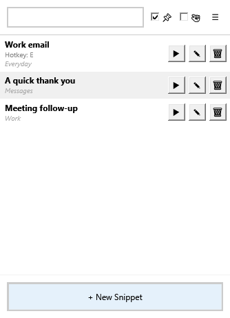
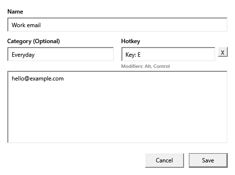
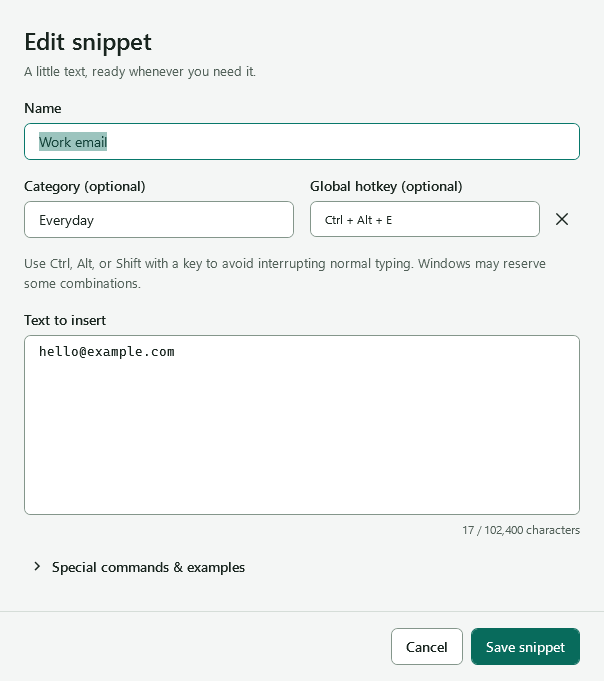
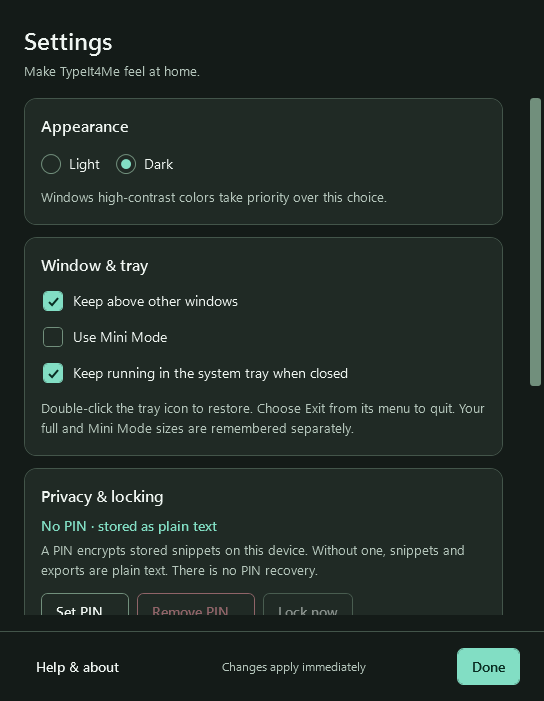
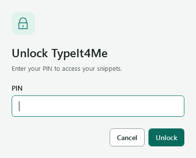
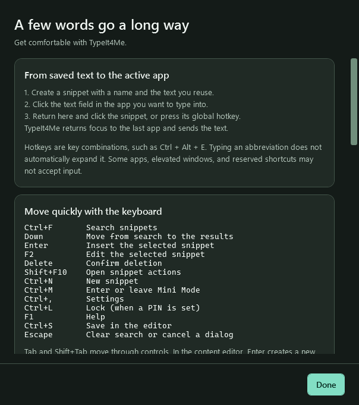

# TypeIt4Me screenshot review

Captured on **Windows 11 on 2026-09-30**, using synthetic snippets only. The current source remains version 1.8.0.

These are actual WPF **client-area** PNGs, not mockups. Native title bars, shadows, desktop surroundings and native file pickers are outside the capture. Baselines come from commit `4347971`; redesigned images use the shared application resources. The isolated review host supplies fake services, while the three `startup-` images come from the real application/services on an interactive desktop with a fresh synthetic profile. See [verification details](../VALIDATION.md).

## Before and after

 

 

## Full and Mini Mode

 

 

## Secondary windows

 

 

## State and size matrix

All 67 deterministic captures are linked below. The 125% and 150% images are 120/144-DPI renders of the same window, rather than physical monitor transition tests. High contrast uses the system-color resource palette without toggling Windows' high-contrast setting.

| State | Light | Dark |
| --- | --- | --- |
| Full library | [Light](light-main.png) | [Dark](dark-main.png) |
| Minimum full size | [Light](light-minimum.png) | [Dark](dark-minimum.png) |
| Mini Mode | [Light](light-mini.png) | [Dark](dark-mini.png) |
| Minimum Mini Mode | [Light](light-mini-minimum.png) | [Dark](dark-mini-minimum.png) |
| Search results | [Light](light-search.png) | [Dark](dark-search.png) |
| No search results | [Light](light-no-results.png) | [Dark](dark-no-results.png) |
| First-run empty | [Light](light-empty.png) | [Dark](dark-empty.png) |
| Locked | [Light](light-locked.png) | [Dark](dark-locked.png) |
| Keyboard focus | [Light](light-keyboard-focus.png) | [Dark](dark-keyboard-focus.png) |
| Unpinned window | [Light](light-unpinned.png) | [Dark](dark-unpinned.png) |
| Working | [Light](light-busy.png) | [Dark](dark-busy.png) |
| Insertion error | [Light](light-target-error.png) | [Dark](dark-target-error.png) |
| 1,000 snippets / virtualization | [Light](light-large-collection.png) | [Dark](dark-large-collection.png) |
| 125% render | [Light](light-main-125.png) | [Dark](dark-main-125.png) |
| 150% render | [Light](light-main-150.png) | [Dark](dark-main-150.png) |
| Snippet editor | [Light](light-editor.png) | [Dark](dark-editor.png) |
| Minimum editor | [Light](light-editor-minimum.png) | [Dark](dark-editor-minimum.png) |
| Special-command reference | [Light](light-editor-commands.png) | [Dark](dark-editor-commands.png) |
| Editor validation | [Light](light-validation.png) | [Dark](dark-validation.png) |
| Inline discard confirmation | [Light](light-discard.png) | [Dark](dark-discard.png) |
| Settings | [Light](light-settings.png) | [Dark](dark-settings.png) |
| Minimum Settings | [Light](light-settings-minimum.png) | [Dark](dark-settings-minimum.png) |
| Settings data section | [Light](light-settings-data.png) | [Dark](dark-settings-data.png) |
| PIN creation | [Light](light-pin.png) | [Dark](dark-pin.png) |
| PIN validation | [Light](light-pin-create-validation.png) | [Dark](dark-pin-create-validation.png) |
| PIN on a short work area | [Light](light-pin-compact.png) | [Dark](dark-pin-compact.png) |
| Scrolled PIN actions | [Light](light-pin-compact-actions.png) | [Dark](dark-pin-compact-actions.png) |
| Remove-PIN confirmation | [Light](light-remove-pin.png) | [Dark](dark-remove-pin.png) |
| Auto-lock input | [Light](light-input.png) | [Dark](dark-input.png) |
| Deletion confirmation | [Light](light-confirmation.png) | [Dark](dark-confirmation.png) |
| Help | [Light](light-help.png) | [Dark](dark-help.png) |
| Minimum Help | [Light](light-help-minimum.png) | [Dark](dark-help-minimum.png) |
| Help privacy / about | [Light](light-help-about.png) | [Dark](dark-help-about.png) |

[High-contrast resource palette](high-contrast-main.png)

## Real startup and services

- [Real application, dark main window](startup-dark-main.png)
- [Real application after locking](startup-locked.png)
- [Incorrect PIN with inline retry](startup-pin-error.png)

The production smoke also exercises tray restoration commands, global hotkeys, foreground activation and SendInput into a second owned process, clipboard preservation, encrypted saving/unlocking, PIN removal and import/export. These screenshots supplement the automated pass/fail report; they do not establish physical mixed-DPI, Narrator or older-Windows coverage.

There are **72 retained images**: 67 deterministic current states, 3 real-startup states, and 2 baseline comparisons. Original stroke icons are MIT licensed with this repository. Windows fonts are rendered on the host and are not redistributed.
